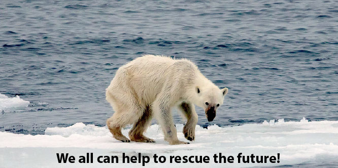
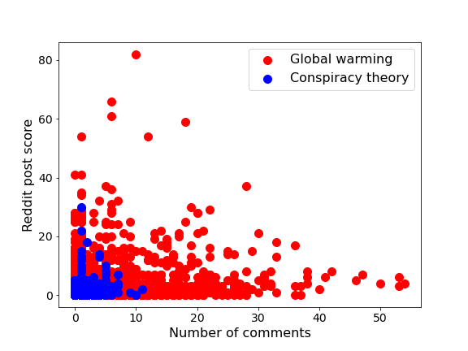
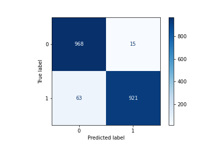
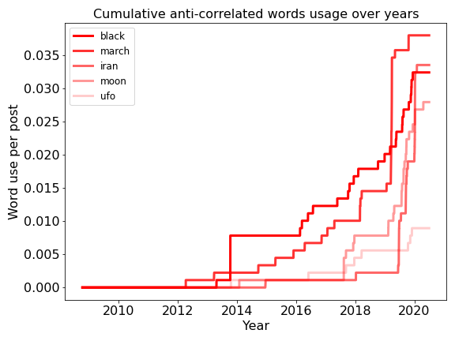

<div style="text-align:center"></div>

# The Global Warming issue and Narratives around it: 
## NLP analysis of Reddit users

Please read the full story at the following published Medium blog post:
[Link](https://towardsdatascience.com/global-warming-and-the-narrative-around-it-lessons-learned-from-nlp-exploration-of-reddit-posts-fb2918d500e9)
<br>

- ### Project Goal

Although recent alarming observations as a direct consequence of human manipulations have proven global warming as a [scientific fact](https://science.sciencemag.org/content/306/5702/1686/), there remains a long way to direct our concerns towards political actions to rescue the future of our planet and the generations to come. Hence, an imminent way to remedy these impacts to save our planet is to look no further than our human species. For any policy to take place, we need to assess the social awareness, current political debates, in any form.

As social media form a major means of our daily conversations and interactions, they bear meaningful insights towards the current state of narratives. Contents are being generated online, on a daily basis, by many of us around the globe. Having a closer look into these contents may help us have a more holistic understanding of the roots of the current state of debate, or whether the designed policies have been effective.

By mining into the social media content, to be specific Reddit, I analzyed these debates and the current state of opinion. Although the societal representativeness of the Reddit users remains a matter of debate, it could be a good proxy, and a good starting point, to look into this debate. I used natural language processing (NLP) workflow along with machine learning to better understand the content.
<br>

- ### Problem statement
---
The Reddit users in **[Globalwarming](https://www.reddit.com/r/GlobalWarming/)** subreddit were in general concerned, while the subreddit users in **[Conspiracytheory](https://www.reddit.com/r/ConspiracyTheory/)** reddit were more interested in coming up with conspiracy theories. This contrasting viewpoint may be a good binary target for our NLP analysis, to develop a trained NLP model. The main question to answer is:<br><br>
<i>**Can my trained classification model discern the global warming topics (as target)?**</i>

---


### <span style="color: green">Project structure
    
The import, data process, as well as modeling and visualizatons were all performed in python. The project directory is structured as follows:
```
project-global_warming_NLP
    
|__ assets/
|__ codes/
|   |__ P01_API_requests.ipynb  
|   |__ P02_Data_Cleaning.ipynb 
|   |__ P03_EDA_NLP.ipynb   
|   |__ P04_Modeling.ipynb
|   |__ P05_Select_Model_Analysis.ipynb
|   |__ P06_Select_Model_Test.ipynb    
|__ datasets/
|__ plots/
|__ Executive_slides_NLP_reddit.pdf
|__ README.md
```

The project was first run on a small dataset of only 500 imported posts, at the production stage, it was run on 10,000 posts.

---

  
    
### <span style="color: green">Step 1 - Data collection
    
I wrote a python function to pull subreddits through API push shift.
    Then, using this function, I imported posts from two global warming and conspiracy theory subreddits. The imported posts date before July 1, 2020. Then, merged the two dataset as a pandas dataframe and saved them to CSV files.

---    
    
### <span style="color: green">Step 2 - Data cleaning
As expected from the unstructured text data, data cleaning is a labor-intensive part of any NLP project. To keep this Readme simple and easy to read, here I just enumerate the cleaning procedures with respect to performance sequence: removing all non-letter characters, string operations, removing stopwords, stemming, and finally stitching back the result back into the data frame and saving it as a CSV file.
    
---
### <span style="color: green"> Step 3 - EDA
    
This step is the fun part after all those labor-intensive data preparation. During exploring the original data frame, I also engineered and added the following features to the data frame for further modeling:<br><br>
1- Character count, word count.<br><br>
2- Sentiment score<br><br>
    
3- Added a new engineered feature and called it word use aggression (WUA). This feature is simply Euclidean distance between the 100 top-ranked features from an initial modeling result (using linear regression to infer most-influencing variables). it is simply the word distance between each top-ranked words, summing over all top-rank words.<br>
    
'[WUA] = sum(|distance between top-word indices|)' <br>

Of course, this new feature can be re-factored into more interesting formats such as unstructured graphs. However, being able to insert a simple value back into the data frame was an attractive choice for me.<br>

    
During EDA, I came across a relation between Reddit scores and the number of comments (Figure below). For conspiracy labels, with the same number of comments, there was a wide range of scores, meaning their thinking is not uniform or united, but there is a narrative heterogeneity between conspiracy theory Reddits. On the other hand, global warming seemed more uniform in that sense, and also showed more comments, meaning more inclination towards discussing. 
    <div style="text-align:center"></div>

    
Hence, I engineered an interaction feature as a multiplication of comments and scores and named it “reaction” as it is the number of comments and scores altogether, which are both reader’s reaction to the writer:<br><br>
'[reaction] = [post score] * [number of comments]'<br>
    

Finally, I vectorized the text, making it production-ready to be fed into models...
    
---   
    
### <span style="color: green">Step 4 - Modeling process
During the modeling step, I tried several classification models including logistic regression, random forest, gradient boosting, Gaussian Naive Bayes, k-Nearest Neighbors, support vector machine, and neural networks. For each model, I created a pipeline and grid searched over the hyperparameters for best model scores on the test set. The best result was from neural networks. The model results are summarized in the following table. For each model, we designed a pipeline, and gridsearched over model parameters to fine-tune the model fior best score, i.e., accuracy. Note that the test size was 0.25 in our scripts, and the following scores are on the test.

|Model|Variables|Accuracy|Precision|Recall|Overfitting(test set: variance - train set: bias)|
|---|---|---|---|---|---|
|Logistic Regression|cvec text|0.95|0.96|0.94|0.03|
|Naïve Bayes|cvec text|0.89|0.92|0.86|0.03|
|Naïve Bayes|tf-idf text|0.95|0.98|0.92|0.02|
|Random Forest|cvec text|0.96|0.98|0.93|0.02|
|Extra trees|cvec text|0.96|0.99|0.97|0.03|
|Gboost|cvec text|0.87|0.84|0.91|0.03|
|Neural network|cvec text|0.95|0.99|0.92|0.02|
|SVM|cvec text|0.94|0.98|0.94|0.90|
====

    
*Note: cvec and TFIDF refer to CountVectorizer (transformer) and TfidfVectorizer, respectively. 
I picked stemming over lemmatization, as it seemed more intuitive to me to reduce the features. Below is the confusion matrix for Random Forest model:
<div style="text-align:center"></div>

### <span style="color: green">Model Discussion
    

- All models do pretty poorly on recall, compared to accuracy and precision. So, it seems like false negatives were a bit high.<br>
- Stemming the words, and using TF-IDF vectorizer rather than CountVectorizer helped the accuracy to a limited extent (by maximum 3%). Among several tested classification models, they had precision values higher than 96% and Recall values higher than 92% on test set.<br>

- Also, the models seemed to be slightly overfit (<2%). From the text vectorizers, tf-idf seemed to be faster and resulted in better scores. Also, random forest gave the best results. As a next stage in the modeling, I decided to also take the numerical features into consideration. Hence, I chose Logistic Regression model to proceed with as it provides a better sense on the feature importance and how much they contribute to the model. It also allows us to test our engineered numeric features. Next section focuses on the text-numerics combined feature model using Logistic Regression.<br>


### <span style="color: green">Step 5 - Evaluation and Conceptual Understanding
    
To further discuss and analyze the findings within the text documents, I proceeded with logistic regression as it provides a more numeric sense of feature importance and I could better see the contribution of the engineered features added to the current variables. Based on the model, the following features were important in determining target labels, listed with respect to their importance: score, word count, sentiment score, reaction, and WUA. The fact that WUA is positively correlated suggests that posts with more concern tended to use the top-words more dispersed from each other.<br>
    Below is the list of features which were found to be most related to the target (both correlated and anti-correlated ones).
    
<div style="text-align:center"></div>


### <span style="color: green">Step 6 - Conclusion and Recommendations

In the following, we show the word use per year, it seems that the world is getting a better place to live in. That's good:
    
<div style="text-align:center"></div>


    
However, the conspiracies also raised:
<div style="text-align:center"></div>

### <span style="color: green"> Model testing on new dataset
       
Climate change is an overarching concern extending well beyond the temperature rise concerns including subjects such as the ozone layer condition, pollution, among other subjects. We used our trained global warming model to filter the subjects specifically related to global warming from a [Climate change](https://www.reddit.com/r/climatechange/) subreddit.
    
From this subreddit, I then fed 100 "climatechange" subreddit posts to filter the global warming topics from other topics.<br>

    
Example of filtered as non-global warming:<br>
    
    'Hi. \n\nI would like to know what lessons we can we take from the COVID-19 pandemic and apply to our climate actions. Specifically businesses and governments. \n\nThanks in advance.'

### <span style="color: green">Final recommendation points
    
    
Based on the presented workflow in this project, we observed how NLP and also numerical features can help us classify the target posts, to infer the current narrative. A few implications were:<br><br>
1- We found the most/least correlated words in determining whether a post is concerned with global warming.<br>
2- Through a few engineered numerical features, we can find a better correlation with the target label.<br>
3- We observed the recent time-series trend to understand the recent narrative trends. There seems to be an increasing trend in both concerns and conspiracies since 2019.<br>
4- We were able to filter the global warming subjects from a more general climate change subreddit.
