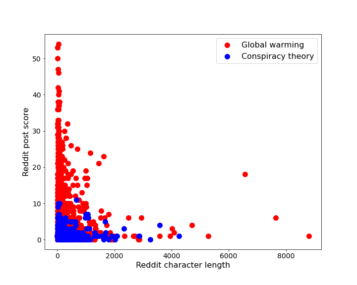
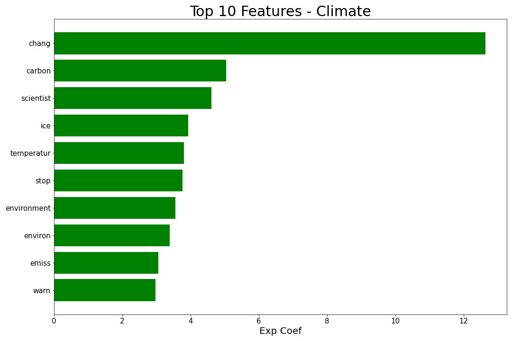
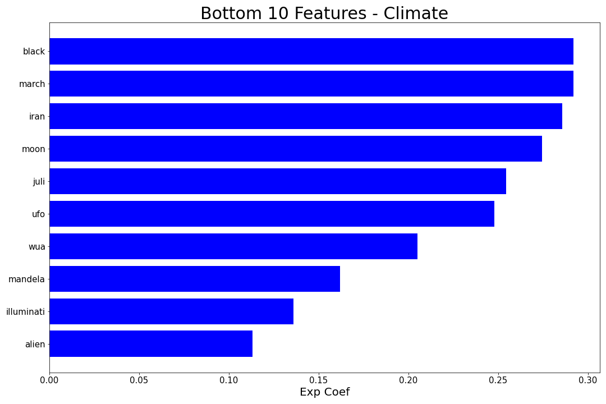
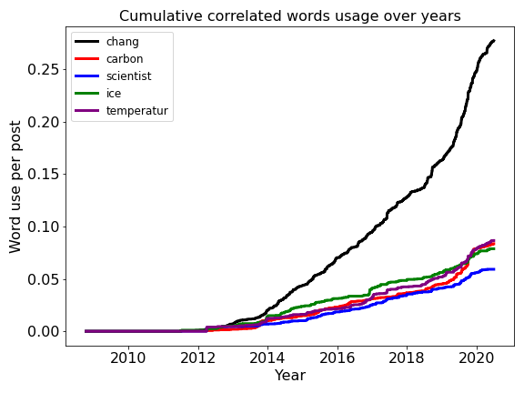

<div style="text-align:center"></div>

# The Global Warming issue and Narratives around it: 
## Sentiment Analysis using NLP methods from Reddit users
<br>

- ### Project Statement

Although the recent alarming observations as a direct consequence of human manipulations have proven climate change as a [scientific fact](https://science.sciencemag.org/content/306/5702/1686/), there remains a long way to direct our concerns towards political actions to rescue the future of our planet and the gernerations to come. Hence, an imminet way to remedy these impacts to save our planet is to look no further thatn our human species. For any policy to take place, we need to assess the social awareness, current political debates, in any form.

As social media form a major means of our daily conversations and interactions, they bear meaningful insights towards the current state of narratives. Contents are being generated online, on a daily basis, by many of us around the globe. Having a closer look into these contents may help us have a more hollistic understanding of the roots of the current state of debate, or whether the designed policies have been effective.

By mining into the social media content, to be specific Reddit, we analzyed these debates and the current state of opinion. Although the societal representativeness of the reddit users remains a matter of debate, it could be a good proxy, and a good starting point, to look into this debate. I used natural language processing (NLP) workflow along with machine learning algorithms to better understand the contents.
<br>

- ### Problem statement
---
The reddit users in **[Globalwarming]** subreddit were in genreal concerend, while the subreddit users in **[Conspiracytheory]** reddit were more interested in coming up with conspiracy theories. This contrasting viewopoint may be a good binary target for our NLP analysis, to develop a trained model.

---


### <span style="color: green">Project structure
    
The import, data process, as well as modeling and visualizatons were all performed in python. The project directory is structured as follows:
```
project-global_warming_NLP
    
|__ code/
|   |__ P01_API_requests.ipynb  
|   |__ P02_data_cleaning.ipynb 
|   |__ P03_EDA_nlp.ipynb   
|   |__ P04-Modeling.ipynb
|   |__ P05-Select_Model_Analysis.ipynb
|   |__ P06-Select_model_production.ipynb    
|__ datasets/
|__ plots/
|__ Executive_slides_NLP_reddit.pdf
|__ README.md
```

The project was first run on a small dataset of only 50 imported posts, at the production stage, it was run on 20,000 posts.

---

  
    
### <span style="color: green">Step 1 - Data collection
    
I wrote a python function to get subreddits through API push shift. Below is a code excerpt (again, I invite you to visit my personal GitHub repository for complete code set): <br> <br>
    Then, using this function, I imported APIs from two "global warming" (link) and conspiracy theory subReddit's. The imported posts date before July 1, 2020. Then, merged the two dataset as a pandas dataframe and saved them to CSV files.

---    
    
### <span style="color: green">Step 2 - Data cleaning
As expected from the unstructured text data, data cleaning is a labor-intensive part of any NLP projects. To keep this readme simple and easy to read, here I just enumerate the cleaning procedures with respect to performance sequence: removing all non-letter characters, string operations, removing stopwords, stemming, and finally stitching back the result back into the data frame and saving it as a CSV file. Here, I only include a section of file where I replaced the "text_marged" column of the dataframe.
    
---
### <span style="color: green"> Step 3 - EDA
    
This step is the fun part after all those labor-intensive data preparation. 
During exploring the original data frame, I also engineered and added the following features to the data frame for further modeling:<br><br>
1- Character counts, word count.<br><br>
2- Sentiment score<br><br>
3- And, I added a new engineer feature and called it word use aggression (wua). This feature is simply Euclidean distance between the top ranked hundred features from an initial modeling result (using linear regression to infer most-influencing variables). it is simply the word distance between each top-ranked words, summing over all top-rank words.<br>
    
WUA = ⎇|w_i - w_top_words| <br>

Of course this new feature can be re-factored into more interesting formats such as unstructured graphs. However, being able to insert a simple value back into the data frame was an attractive choice for me.<br>

    
During EDA, I found that score, sentiment score, document word count, and character length were the most correlated variables to the target class. also for the positive documents, the score was directly correlated with character length. While, for negative comment, it was neutral. That suggests the people who were concerned, tended to show their concern through longer messages.<br>
    
<div style="text-align:center"></div>

    
Finally, I vectorized the text, making it production-ready to be fed into models...
    
---   
    
### <span style="color: green">Step 4 - Modeling process
A handful of classification models were run on the train/test split dataset, and the model results are summarized in the following table. For each model, we designed a pipeline, and gridsearched over model parameters to fine-tune the model fior best score, i.e., accuracy. Note that the test size was 0.25 in our scripts, and the following scores are on the test.

|Model|Variables|Accuracy|Precision|Recall|Overfitting(variance - bias)|
|---|---|---|---|---|---|
|Logisitc Regression|cvet text|0.96|0.96|0.97|0.02|
====

    
*Note: cvec and TFIDF refer to CountVectorizer (transformer) and TfidfVectorizer, respectively. 
I picked stemming over lemmatization, as it seemed more intuitive to me to reduce the features. Below is the confusion matrix for the best model we devloped:
<div style="text-align:center"></div>

    


### <span style="color: green">Step 5 - Evaluation and Conceptual Understanding
    
Below is the list of features which were found to be most related to the target.
    
<div style="text-align:center"></div>

Below is the list of features which were found to be least related to the target.
<div style="text-align:center"></div>


### <span style="color: green">Step 6 - Conclusion and Recommendations

In the following, we show the word use per year, it seems that the world is getting a better place to live in. That's good:
    
<div style="text-align:center"></div>


    
However, the conspiracies also raised:
<div style="text-align:center"></div>

    

Finally, to test whether we are production-ready, we tested the dataset on a new test dataset: climate change.<br>
    
Climate change is over-arching to the global warming

Accuracy score: 0.91
    
Fed 50 "climatechange" subreddit posts to separate the global warmings from other topics. The folowing were diagosed as non-global warming:

    
    
Example of filtered as non-global warming:
    
    'Hi. \n\nI would like to know what lessons we can we take from the COVID-19 pandemic and apply to our climate actions. Specifically businesses and governments. \n\nThanks in advance.'


Final recommendation points:
    
- The society seem to have been more aware towards global warming since 2018.

- However, we need to beware of the media that feeds conspiracy to people, as it also raised.

- The current model seems to be able to be taken to be production-ready
